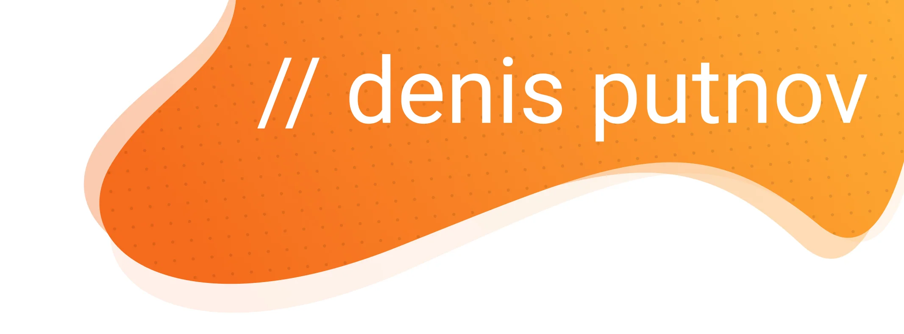

## Hi, I am Denis Putnov

I am a developer from Voronezh. 

Some words about me:
- You can find my code blog in Telegram. It is for russian audience. I write posts there on free days 
- I love and at the same time hate JavaScript. You know, it's a strange relationship 🙂
- I am currently working on my products and pet-projects and improve my coding skills.

### Technologies:

&nbsp;
&nbsp;
&nbsp;
&nbsp;
&nbsp;
&nbsp;
&nbsp;
&nbsp;
&nbsp;
&nbsp;
&nbsp;
&nbsp;
&nbsp;
&nbsp;

### Tools:

&nbsp;
&nbsp;
&nbsp;
&nbsp;
&nbsp;
&nbsp;
&nbsp;
&nbsp;
&nbsp;
&nbsp;
&nbsp;
&nbsp;

### Contacts: 

  
  
  

